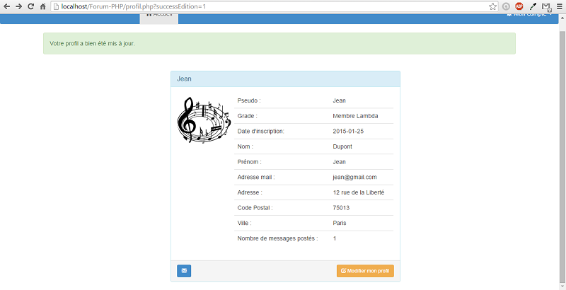

# Forum-PHP
## 1. Navigation en tant que visiteur

Un visiteur peu naviguer dans le forum et voir les différents sujets et messages postés. 
Par ailleurs, un outil de recherche par filtre est mis à sa disposition pour faire une recerche. 
De plus, il a la possibilité de créer un compte utilisateur.
Cependant, il ne peut pas poster de messages, ajouter de sujets etc ...
Si le visiteur essaie d'acceder à un contenu qui demande une authentification préalable un message d'erreur spécifique sera affiché.

Exemple : "Vous n'êtes pas autorisé à accéder à ce contenu. Connectez-vous ou inscrivez-vous."

## 2. Création d'un compte utilisateur - Informations personnelles

La création d'un compte utilisateur se fait de façon très simple. Pseudo, mot de passe et e-mail. 

De plus, il est possible de compléter son profil avec des informations supplémentaires : Voir partie 3.2.

## 3. Connexion au site en tant qu'utilisateur

Lorsque qu'un utilisateur se connecte au site à l’aide de ses identifiants : login et mot
de passe, vous accédez à la page suivante : 

### 3.2 Modification des données personnelles

L'utilisateur peut modifier, s'il le souhaite ses données personnelles.

Et afficher son profil

## 4. Connexion au site en tant qu'administrateur

Lorsque l'administrateur se connecte au site à l’aide de ses identifiants : login et mot
de passe, il accède à la page suivante : 

### 4.2 Modification des données personnelles

L'administrateur peut modifier, s'il le souhaite ses données personnelles et celles des utilisateurs.
Par ailleurs, il peut aussi attribuer le rôle d'administrateur à un utilisateur.

Et afficher son profil

## 5. Recherches par filtres

Il est possible de faire des recherches à l'aide d'un filtre comme ci-dessous :

## 6. Génération XML

Nous pouvons générer un fichier XML à partir d'une sous-catégorie. Un menu déroulant avec toutes les sous-catégories.

Fichier génnéré après :

## 7. Diagramme de cas d'utilisation

## 8. Modèle conceptuel des données (MCD)

